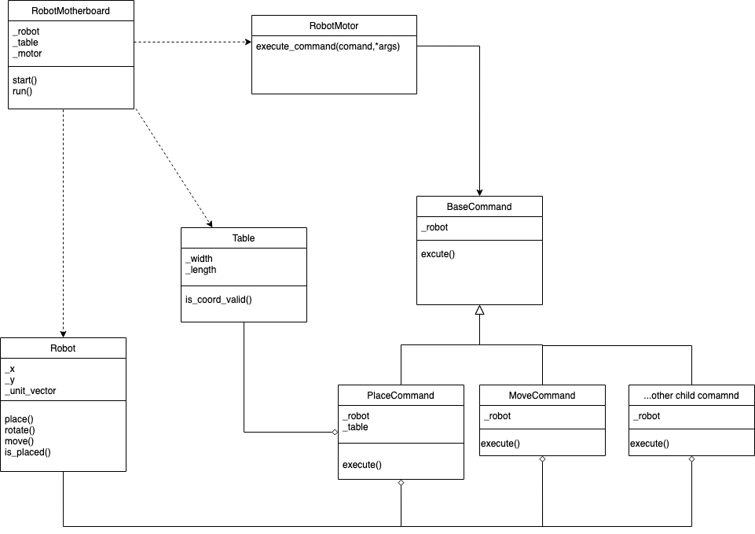

# Toyro[bot]

My implementation to the toy robot challenge. The name `Toyro`  is inspired by the company that I currently work for. Built with 🏳️‍🌈.

## Getting Started

Incase you might already review hundreds of applicant's codes, I wanted to show you something different - present you an overview of the design and my thoughts behind the decision I made.

### Command pattern as the design pattern

The command pattern is a good fit in the implementation since the robot is "command driven". It is extendable if we want to add more commands such as `AVOID` and `JUMP` , or even increase the table size:

- `Robot` is the `receiver` who has the bussiness logic
- `Table` can be considered as the `receiver` since it provide the table boundary for the robot to prevent falling
- `BaseCommand` is the interface for list of commands such as `PLACE` or `LEFT`. The child class including `PlaceCommand` will implement the execution method
- `RobotMotherboard` serves as the `client` to instantiate all the components required by the robot and bootstrap them
- `RobotMotor` executes the commands from `RobotMotherboard` and operate the robot as a `sender/invoker`



### Test driven development

  Besides TDD allows me identify the bugs upfront, it also helps me modularise the codes and isolate the component in testing (with dependency injection).
  
- Achieved 94% of the coverage
- (TBD) Intergrate with github action or CI/CD pipeline

### Error handling

The robot will raise an exception if they overstep or attempt to execute without being placed - I implemented 2 reusable decorators for the error handling and logging.

## Environment

The codes are developed in Python 3.9.13 environment. I haven't used any new syntax (i.e. `match`) so Python 3.x environment should work.

## Usage

Before running the toy robot, it's recommended to set up an virtual environment. See: <https://docs.python.org/3/library/venv.html>

Assume you are in the virtual environment, to install required packages (for testing), run

```bash
pip install -r requirements.txt
```

Simply run the following command to bootstrap the robot

```bash
python main.py
```

Run the unit tests in virtual environment:

```bash
pytest -rP

# to generate coverage report
pytest --cov-report= --cov=toyro tests/
```
